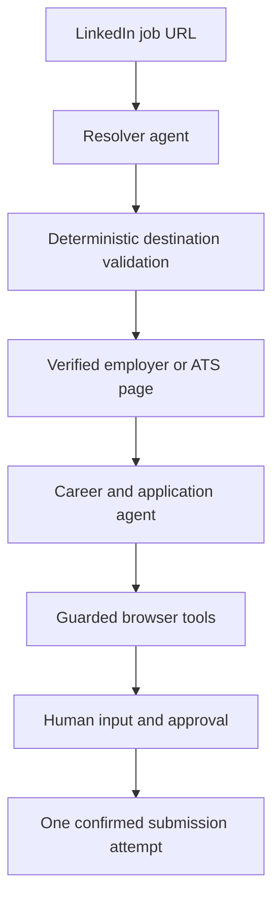

# Jobnova

Jobnova combines Projects 2 and 3 of the take-home in one deployed product. Paste a LinkedIn job URL to resolve its matching employer or ATS page. Continue in the career chat to inspect the role, complete guarded application fields, and approve the final submission.

## Try the deployed product

**Live URL:** `OWNER_TO_ADD_RAILWAY_URL`

**Invite code:** `OWNER_TO_SHARE_SEPARATELY`

To test the core flow in about 30 seconds:

1. Open the live URL and enter the invite code.
2. Paste a fresh `https://www.linkedin.com/jobs/view/<job_id>` URL into **Quick resolve**.
3. Keep the page open to watch the result, or close it and return to the run URL later.
4. Paste a job URL into **Career agent** to start the guided application flow.

The deployed service requires its invite code on every API request. Completed resolver runs persist across process restarts.

## Results

### Frozen resolver evaluation

**Result:** `OWNER_TO_ADD_CORRECT_COUNT/20 correct`

The owner runs the frozen 20-case subset locally and checks the exported results into `data/evaluation.json`. The deployed product renders that file as an evidence table. Until the owner imports the run, the table displays a pending state rather than a fabricated score.

### Lever application proof

**Status:** `OWNER_TO_ADD`

| Evidence | Result |
|---|---|
| Fields completed | `OWNER_TO_ADD` |
| Runtime | `OWNER_TO_ADD` |
| Confirmation | `OWNER_TO_ADD` |
| Screenshots | `OWNER_TO_ADD` |

The owner performs the one authorized submission with the synthetic profile. No deployed or automated verification in this repository claims that the submission ran.

## How Jobnova works



The resolver uses deterministic browser actions first. Stagehand interprets page meaning only when visible evidence is ambiguous. TypeScript validates the final company, role, and destination before the API reports success.

The application flow separates model-visible reasoning from private browser actions:

- The model receives semantic field keys, tool status, and value-free page state.
- TypeScript resolves candidate facts and writes values through guarded tools.
- Missing private values use inline interaction cards. Responses do not appear in the chat transcript.
- Generated free-form answers require approval.
- Submission requires a fresh final audit and one explicit confirmation.

The HTTP service keeps at most two Browserbase sessions live across resolver runs and chats. An idle chat releases its browser after 10 minutes. The Mastra thread and career state remain available, and the next message reopens the current job URL.

## Run locally

Requires Node.js 22 or later.

```bash
npm install
cp .env.example .env
npm run build
npm test
npm run serve
```

Open `http://localhost:3000`.

### Environment variables

| Variable | Required | Purpose |
|---|---:|---|
| `ACCESS_CODE` | Yes for the server | Invite code required by every `/api` route |
| `OPENAI_API_KEY` | When `LLM_PROVIDER=openai` | OpenAI model access |
| `GEMINI_API_KEY` | When `LLM_PROVIDER=gemini` | Gemini model access |
| `LLM_PROVIDER` | No | `gemini` by default; Railway can set `openai` |
| `BROWSERBASE_API_KEY` | Yes for Browserbase | Creates remote browser sessions |
| `BROWSERBASE_PROJECT_ID` | Yes for Browserbase | Selects the Browserbase project |
| `BROWSERBASE_CONTEXT_ID` | Recommended | Reuses the owner’s authenticated LinkedIn context |
| `BROWSER_PROVIDER` | No | Browserbase by default; use `local` for local proof runs |
| `MASTRA_DATABASE_URL` | No | LibSQL file or remote URL; defaults to `file:./mastra.db` |
| `MASTRA_DATABASE_AUTH_TOKEN` | Only for remote LibSQL | Remote database credential |
| `SCREENSHOTS_DIR` | No | Screenshot output; Railway uses `/data/screenshots` |
| `PORT` | No | HTTP port; defaults to `3000` |

For Railway, mount one persistent volume at `/data` and set:

```text
MASTRA_DATABASE_URL=file:/data/mastra.db
SCREENSHOTS_DIR=/data/screenshots
```

Leave `BROWSER_PROVIDER` unset in Railway. Run `npm run auth` once with the production `BROWSERBASE_CONTEXT_ID` to establish the owner’s LinkedIn session.

### Commands

| Command | Purpose |
|---|---|
| `npm run serve` | Start the built HTTP service and static web app |
| `npm run resolve -- <linkedin-url>` | Run the one-shot resolver CLI |
| `npm run apply:chat` | Run the terminal career chat |
| `npm run auth` | Authenticate the configured browser context |
| `npm run profile:synthetic` | Replace the ignored candidate profile with synthetic data |
| `BROWSER_PROVIDER=local npm run apply:test -- --url <lever-url>` | Fill and validate without submission |
| `BROWSER_PROVIDER=local npm run apply:submit -- --url <lever-url>` | Perform one explicitly authorized submission |

## Service API

All routes require `x-access-code: <ACCESS_CODE>`.

- `POST /api/runs` with `{ "url": "..." }` starts a detached resolver run.
- `GET /api/runs/:id` returns its status, result, safe trace, runtime, and protected screenshot URLs.
- `POST /api/chat` creates an in-memory career session.
- `POST /api/chat/:id/message` and `/respond` stream safe career events over SSE.
- `POST /api/chat/:id/end` closes the session and releases its browser.
- `GET /api/eval` returns the checked-in evaluation evidence.

## Limits

- The application proof covers one Lever flow, not every ATS.
- LinkedIn uses the owner’s persistent Browserbase context. LinkedIn checkpoints or expired authentication block the run cleanly.
- The server uses one always-on process and an in-memory chat-session map. It is not designed for horizontal scaling.
- The invite code is a take-home access gate, not account security.
- The product does not provide multi-tenancy, queues, scheduled work, billing, or background workers.
