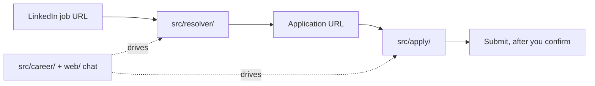

# Jobnova codemap

Jobnova resolves LinkedIn job posts to employer application pages and fills the forms with human approval. Start it with `npm run serve`, then open `http://localhost:3000`.

## How Jobnova works

Jobnova has three parts:

- **Resolver** (`src/resolver/`): turns a LinkedIn job URL into an employer or ATS application URL.
- **Form engine** (`src/apply/`): reads the application form, fills fields from the candidate profile, and stops for human approval before it submits.
- **Career chat** (`src/career/`, `web/`): talks through roles and drives the resolver and form engine over chat.

One Node 22 process serves the API and the chat UI (`src/server.ts`). The agents drive browsers on Browserbase or local Chrome (`src/browser/`). At most two browsers stay live; an idle one closes after 10 minutes.



## Run

| Command | What it does |
|---|---|
| `npm run serve` | Start the server on `PORT` (default 3000) |
| `npm run resolve -- <linkedin-url>` | Resolve one LinkedIn URL and print the result as JSON |
| `npm run apply:chat` | Career chat in the terminal |
| `npm run apply:test -- --url <lever-url>` | Fill a Lever form without submitting (prefix with `BROWSER_PROVIDER=local` for a local browser) |
| `npm run apply:submit -- --url <lever-url>` | Fill and submit once, with approval |
| `npm run auth` | Log in to LinkedIn and save the session |
| `npm run profile:synthetic` | Replace the candidate profile with synthetic test data |
| `npm test` | Run the test suite |
| `npm run build` | Build the server and the web UI |

## File tree

```text
src/
├── server.ts                  # routes, SSE, web/out/, access gate
├── server/runStore.ts         # resolver-run table
├── index.ts                   # npm run resolve
├── auth.ts                    # npm run auth
├── types.ts                   # ResolverResult, ApplicationResult
├── resolver/                  # LinkedIn URL → application URL (3 files)
├── apply/                     # form engine (19 files)
├── career/                    # chat agent, sessions (2 files)
├── mastra/                    # models, storage, retries (6 files)
└── browser/                   # Browserbase + local Chrome (2 files)
web/
├── app/page.tsx               # chat, access gate, drawer, cards
└── lib/jobnova-transport.ts   # SSE → chat parts
```

## Modules to features

| Module | Serves |
|---|---|
| `src/resolver/` | Resolve a post, in the drawer or via `npm run resolve` |
| `src/apply/` | Fill a form, ask for missing values, audit, submit |
| `src/career/` | Chat, sessions, idle browser release |
| `src/mastra/` | Model choice, thread memory, 429 retries, history trim on every agent turn |
| `src/browser/` | LinkedIn login, remote and local browsers |
| `src/server.ts`, `src/server/runStore.ts`, `src/types.ts` | Routes, SSE streams, run history, access gate |
| `web/` | Chat window, resolve drawer, input cards |

## Features

### Resolve a LinkedIn post

`ResolverCard` posts the URL to `POST /api/runs`. `RunStore` records `queued` → `running`. `resolveDirectLinkedInJob()` reads the page for an external apply link, Stagehand helps only when the DOM is ambiguous, and `validateDestination()` accepts only HTTPS URLs that leave LinkedIn and match the role. The run ends `completed` or `failed`.

### Talk through a role

`ChatWorkspace` sends messages through `JobnovaTransport` to `POST /api/chat/:id/message`. `CareerSession` runs the `createCareerRuntime()` agent, which opens your URL (`open_supplied_job`) and locks onto forms (`enter_application_mode`). `compactSupersededSnapshots()` trims old DOM dumps; `getMastraStorage()` keeps threads across restarts.

### Fill a form

`inspectCurrentPage()` lists controls as `@ref` handles. `execute_application_actions` fills up to 20 controls a turn from the `candidateProfileToCatalog()` facts. `createRunLedger()` keeps each field filling once. The model sees handles and keys, never values.

### Ask for missing values

`request_user_inputs` pauses the turn and shows one `InteractionCard`. Your answers resume the turn.

### Approve and submit

`finalAudit()` checks the form, `captureFullPageScreenshot()` saves the page, and `request_submission` asks you to confirm. One click submits once. No retries.

## Rules

1. **The model never sees values.** Prompts carry `@ref` handles and fact keys. TypeScript binds values in memory (`generalBrowserTools.ts`, `candidateCatalog.ts`).
2. **Nothing submits without you.** No retries on the submit click. Each run needs a fresh audit, a screenshot, and your confirmation (`generalSafety.ts`, `careerAgent.ts`).
3. **Destinations stay outside LinkedIn.** HTTPS only. No login walls or search pages (`validateDestination.ts`).
4. **Two browsers at most.** Idle browsers close after 10 minutes (`src/server.ts`).
